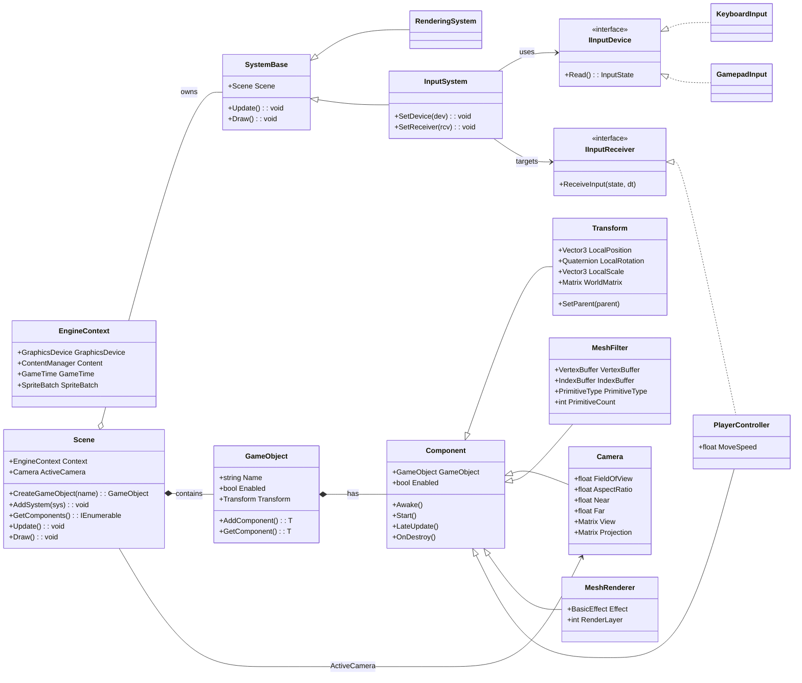

# 3DGED — Unity-Modeled ECS Engine on MonoGame

## Overview
This repository contains a minimal-but-structured 3D engine scaffold for MonoGame (3.8+). It adopts Unity-style names and lifecycles so students can transfer knowledge directly: `Scene`, `GameObject`, `Component`, `Transform`, `Camera`, `MeshFilter`, `MeshRenderer`, `SystemBase`, `RenderingSystem`, `InputSystem`, etc. 

It is designed for **incremental classroom live-coding** and emphasizes clear separation of **data (components)** from **behavior (systems)**.

## Module Notes 

- [Understanding PrimitiveType](Notes/Notes%20-%20Understanding%20Primitives.md)
  - [Exercises - Understanding PrimitiveType](Exercises/Exercises%20-%20Understanding%20Primitives.md)
-  [Understanding Effect](Notes/Notes%20-%20Understanding%20Effects.md)


## Required Reading 
 
- [Drawing 3D Primitives using Lists or Strips](https://docs.monogame.net/articles/getting_to_know/howto/graphics/HowTo_Draw_3D_Primitives.html#:~:text=Overview,basic%20effect%20and%20transformation%20matrices.)
- [Quick Understanding of Homogeneous Coordinates for Computer Graphics](https://www.youtube.com/watch?v=o-xwmTODTUI)
- [Article - World, View and Projection Transformation Matrices](http://www.codinglabs.net/article_world_view_projection_matrix.aspx)

## Recommended Reading 

- [Computer Graphics | The MVP Matrix (Model-View-Projection) in 3D Rendering](https://www.youtube.com/watch?v=a_rX4xfYcy4)
- [MonoGame Documentation - Graphics and Shaders](https://docs.monogame.net/articles/getting_started/5_adding_basic_code.html)
- [DirectX Documentation - Primitive Topologies](https://docs.microsoft.com/en-us/windows/win32/direct3d11/d3d10-graphics-programming-guide-primitive-topologies)
- [OpenGL Tutorial - Drawing Primitives](https://www.khronos.org/opengl/wiki/Primitive)

## Project Folder Structure
```
/Engine
  /Core        (EngineContext, Scene, GameObject, Component, SystemBase)
  /Components  (Transform, Camera, MeshFilter, MeshRenderer, PlayerController, Rotator)
  /Systems     (RenderingSystem, InputSystem)
  /Input       (IInputDevice, IInputReceiver, InputAction, KeyboardInput,  MouseInput, GamepadInput)
/Game          (Main bootstrap)
/Content       (MonoGame Content Pipeline)
```

## Design Prompts 
Use these questions to consider the architectural requirements:

### Scene & lifecycle
- MonoGame gives us `Update/Draw`. What extra structure do we need so game code doesn’t live in `Game1` forever?
- What belongs to a **Scene** vs a **GameObject**? Who creates/destroys objects?
- Why guarantee `Awake → Start → Update → LateUpdate → OnDestroy`, and why must **Start run once** before the first `Update`?

### Components vs Systems
- If components hold **data** (and only narrow local logic), what kinds of work should **Systems** centralize (Rendering, Input, Physics)?
- How do systems *query* the world for the sets they care about without tight coupling?

### Transform & hierarchy
- Why separate `Transform` from `GameObject` fields?  
- How should parent→child S·R·T compose into a world matrix, and where do `Forward/Right/Up` live?

### Camera
- What data does a camera need (FOV, aspect, near, far)?  
- Should it compute `View/Projection` every frame or only when dirty?

### Geometry & rendering
- Why split **MeshFilter** (geometry) from **MeshRenderer** (material/state)?  
- Where should WVP be set, and what minimal GPU data do we need (VB, optional IB, primitive type/count)?

### Input (devices & targets)
- Why abstract input devices (`KeyboardInput`, `GamepadInput`) behind `IInputDevice`?  
- What is an `IInputReceiver` and how do we hot-swap targets (player ↔ UI)?

### Engine services
- Which services (GraphicsDevice, Content, timing) should be centralized, and how do we access them without globals?

## Class Diagram 

The diagram below lists the principle components of our 3D game engine implementation.



## Design Objectives
| Objective | Why it matters (student mental model) | Implementation notes / where to look | Future extension |
|---|---|---|---|
| **Unity‑parity naming** (`GameObject`, `Component`, `Transform`, `Camera`, `MeshFilter`, `MeshRenderer`, `SystemBase`) | Reduces cognitive load: students already “think in Unity.” They can transfer expectations about composition and responsibilities without re-learning names. | All core types mirror Unity roles; see `/Engine/Core` and `/Engine/Components`. | Add aliases or adapters if migrating Unity projects or building import tools. |
| **Lifecycle guarantees** (`Awake → Start → Update → LateUpdate → OnDestroy`) | Deterministic sequencing prevents “half-initialized” bugs. One‑time **Start** aligns with Unity, making behavior predictable when components are added mid‑frame. | `Scene` manages `_pendingStart`; components receive `Awake` on add, `Start` before first frame; `LateUpdate` runs after Systems.Update. | Add `OnEnable/OnDisable`, `OnValidate`, and editor-time checks; make “dirty” update only when needed. |
| **Data / behavior split** (Components vs Systems) | Encourages modular, testable code. Components are data + tiny local logic; Systems own iteration and orchestration (SRP). | See `RenderingSystem`, `InputSystem`. Components avoid heavy `Update`; use `LateUpdate` for local post‑work. | Add `Query` helpers, system ordering, event/pipeline stages (Physics → Animation → Render). |
| **Scene graph & hierarchy** (S·R·T → world) | Builds intuition for parent/child transforms, local vs world space, and camera‑relative motion. | `Transform` composes LocalScale · LocalRotation · LocalPosition; exposes `WorldMatrix`, `Forward/Right/Up`. | Add transform “dirty flags,” re-parent with world‑space preservation, gizmo helpers. |
| **Camera** (View/Projection from `Transform`) | Connects math to visuals: changing pose or lens changes what you see. | `Camera.LateUpdate` computes `View` and `Projection`; `Scene.ActiveCamera` consumed by renderer. | Multi‑camera, render targets, post‑processing, and camera stacking. |
| **Rendering pipeline** (`MeshFilter` + `MeshRenderer` + `RenderingSystem`) | Separates **what** to draw (geometry) from **how** to draw (material/state). Models Unity’s MeshFilter/MeshRenderer pattern. | `MeshFilter` holds VB/IB/Primitive info; `MeshRenderer` owns `BasicEffect`; system sets WVP and issues draw calls with depth testing and simple `RenderLayer`. | Material abstraction (Effect graph), instancing, frustum culling, batching, skeletal skinning. |
| **Input abstraction** (devices & receivers) | Swappable devices (keyboard/gamepad) and targets (player/UI) decouple hardware from behavior; simplifies testing. | `IInputDevice` (`KeyboardInput`, `GamepadInput`) + `InputSystem` routing to an `IInputReceiver` (e.g., `PlayerController`). | Add rebinding, input maps, actions/axes config, UI navigation, touch. |
| **Engine services** (`EngineContext`) | Centralized access to `GraphicsDevice`, `Content`, and timing without globals; easier to reason about and mock. | Constructed in `Game1`; passed into `Scene`; available to Systems/Components via `Scene.Context`. | Add asset registry, diagnostics, profiler hooks, and dependency‑injected services. |
| **Pedagogy & iteration** | Small, compiling steps keep momentum in live coding; students can extend any layer independently. | Roadmap steps (Camera → Context → Scene → Components → Rendering → Input). | Provide per‑step exercises, unit tests, and challenge branches (lighting, physics, UI). |

## Useful Links
- [Design Patterns](https://refactoring.guru/design-patterns)
- [Game Programming Patterns](https://gameprogrammingpatterns.com/contents.html)  

## To Do 

- [Weekly Development Plan](ToDo.md)


